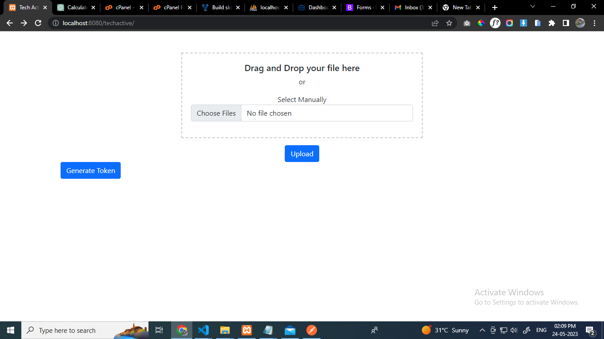
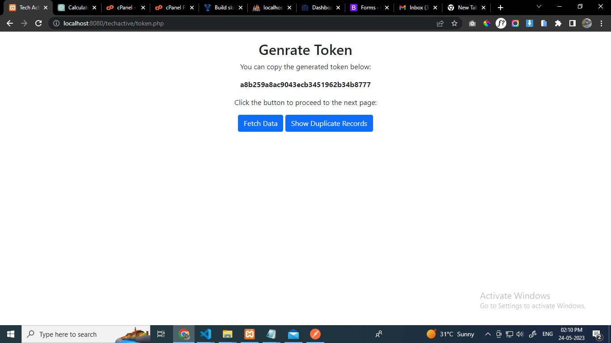
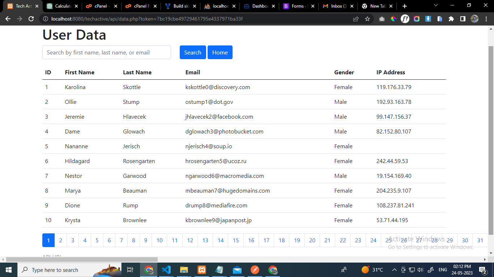
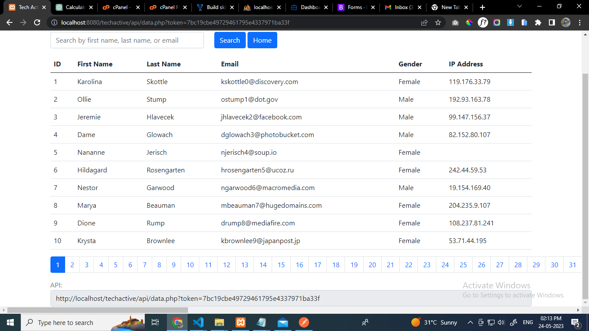
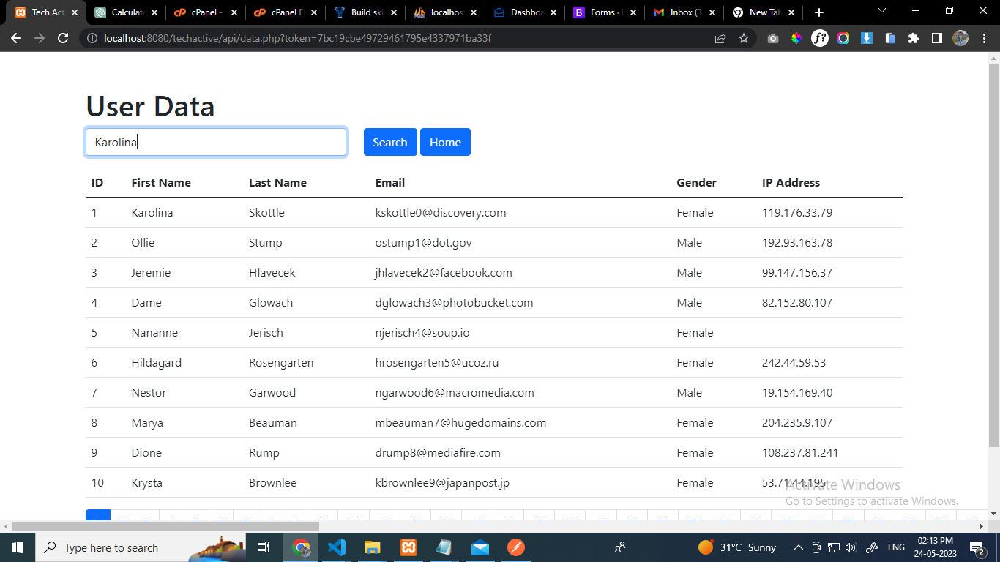
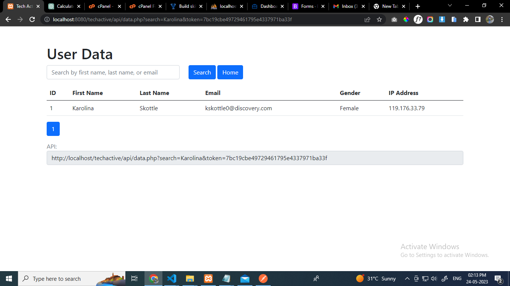
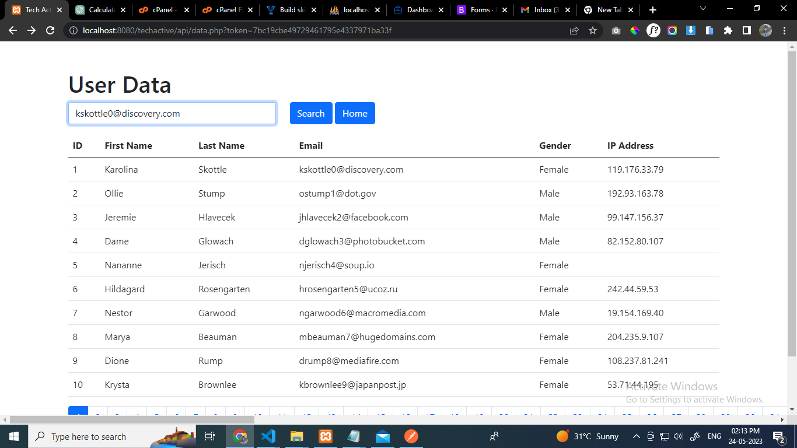
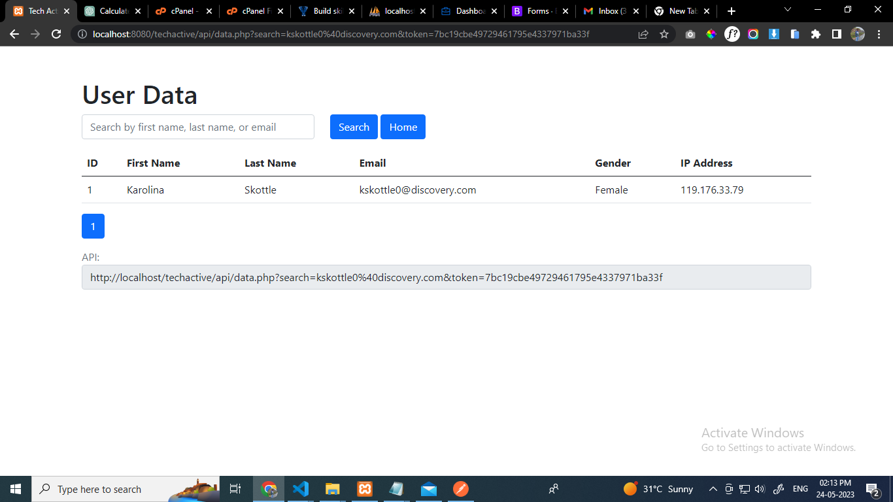
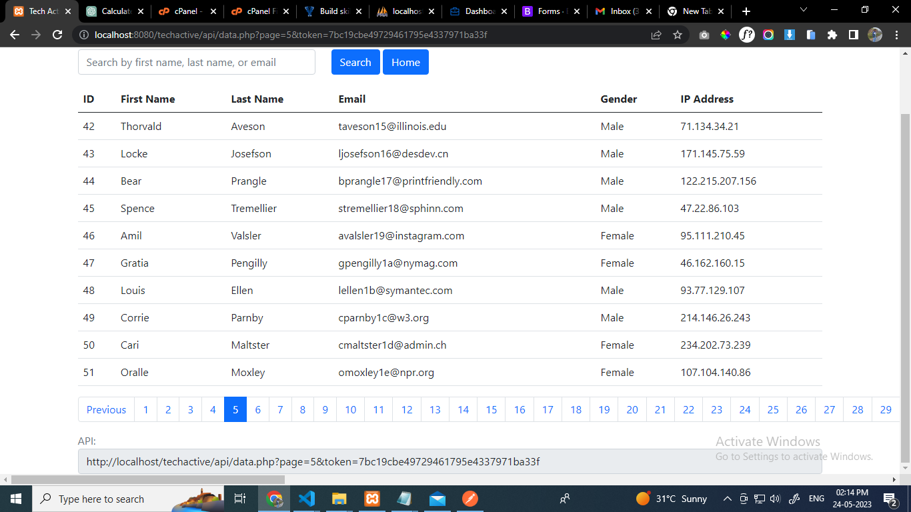
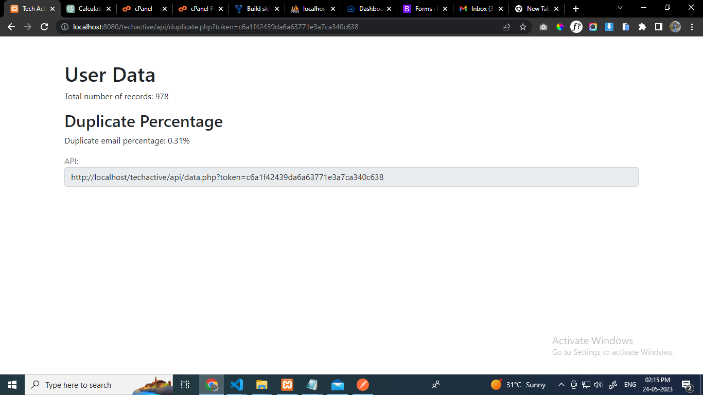

### This Project is for Tech Active Assessment
    It has all the task which are mentioned belowed

Task 1.

Create a sample PHP function to bulk insert to MySQL
-> Using the mock CSV file import the user-details to MySQL table : users

-> The email-id should be unique

-> While inserting if the email is duplicate, Need to maintain a table for counting the number of times the duplicate occurance.

Task 2.

-> Create an API to generate a token, which should be used in the below APIs to fetch details.

-> Create an API to fetch these user-details, the API should have pagination and should be able to search first or last name or email-id.

-> Create another API to know the percentage of duplicate Records and total-records.

    To ensure uniqueness of email addresses in the user table, any duplicated emails are typically stored in a separate table called duplicate_count.

# Screenshots Of The Project

## Step-1

## Step-2

## Step-3

## Step-4

## Step-6

## Step-7

## Step-8

## Step-9

## Step-10

## Step-11

## Step-13
